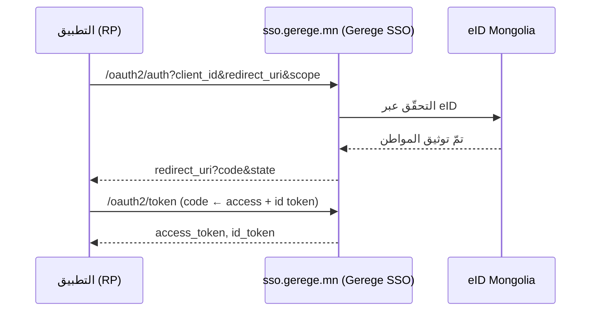

# المصادقة (eID + Gerege SSO)

تدعم المنصّة ما يلي:

- **الدخول عبر eID** — بالهوية الإلكترونية (رمز الاستجابة السريعة / App2App /
  إشعار برقم السجل).
- **الربط بحساب Google** — ربط حساب Google بعد التحقّق عبر eID.
- **Gerege SSO (OIDC)** — تعمل المنصّة نفسها مزوّدَ OpenID Connect، وتدخل
  التطبيقات من خلاله.

## دوران اثنان — `AUTH_MODE`

المكان الذي يسجّل فيه المستخدم النهائي دخوله على هذه المنصّة ليس اختلافًا في
الشيفرة، بل **إعداد**:

| `AUTH_MODE` | في الصفحة الرئيسية و`/login` | الاستخدام المعتاد |
|---|---|---|
| `provider` | تُعرض بطاقة الدخول (رقم السجل/رمز eID · Google) هنا | خدمة هوية (`sso.dgov.mn`، `sso.gerege.mn`) |
| `client` | تحويل إلى نظام الدخول الموحّد الأعلى (`SSO_ISSUER`) | منصّة تستهلكه (النشر المرجعي لهذا القالب) |

إذا لم يُضبط، يُستنتج الوضع من وجود `SSO_CLIENT_ID`.

وبذلك **تعمل خدمة الدخول الموحّد والمنصّة التي تستهلكها على الشيفرة نفسها** —
فتُقلَع صورة Docker ذاتها بأيّ من الدورين تبعًا لبيئتها.

!!! note "كون المنصّة مُصدِرًا سؤال منفصل"
    يجيب `AUTH_MODE` عن سؤال «أين يسجّل **مستخدمو هذه المنصّة** دخولهم». أمّا
    كونها مُصدِرًا **لتطبيقات أخرى** فيحدّده `OAUTH_ISSUER` أدناه بشكل منفصل —
    ويمكن تفعيلهما معًا.

تقرأ الواجهة الأمامية وضعها من نقطة النهاية العامة `GET /api/v1/site/auth`:

```json
{ "mode": "client", "sso_issuer": "https://sso.gerege.mn", "provider": false }
```

المزيد: [الإعدادات](configuration.md).

## الدخول عبر eID

إشعار مباشر إلى تطبيق eID (App2App) أو مسح رمز استجابة سريعة. تعتمد الجلسات على
رمز وصول JWT + رمز تحديث (بالتدوير)؛ ويُبطل تسجيلُ الخروج كليهما (قائمة رفض
للوصول والتحديث). ولا توجد كلمة مرور ولا دخول بالبريد أو برمز OTP.

الحقل `sub` هو **معرّف المواطن الثابت والمبهم** الخاصّ بالمنصّة (UUID المستخدم)،
ويُمرَّر إلى مزوّد OIDC المدمج ضمن المسار.

## Gerege SSO (مزوّد OIDC)

المنصّة مزوّد OpenID Connect مبنيّ على **شيفرة Go الخاصّة بها**. تفوّض تطبيقاتُ
الأطراف المعتمِدة (RP) تسجيلَ الدخول إلى المنصّة، وتتلقّى بيانات المستخدم
الموثَّقة على هيئة claims قياسية.



!!! tip "الدخول الموحّد خدمة مدمجة (أساسية)"
    يُقدَّم الدخول عبر SSO تلقائيًّا **لكلّ تطبيق مسجَّل** عبر نطاقات OIDC
    الأساسية (`openid profile email`)، فلا يُمنح ولا يُحجب لكلّ تطبيق على حدة.
    أمّا الخدمات **الإضافية** (مثل وكيل eID) فتتطلّب تخويلًا لكلّ تطبيق — انظر
    [وكيل خدمات eID](eid-services.md).

لربط تطبيقك كطرف معتمِد، انظر [تكامل التطبيقات](sso-integration.md).
