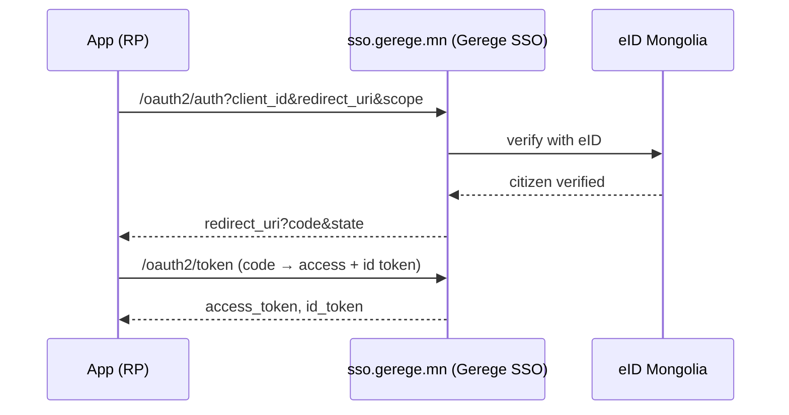

# Authentication (eID + Gerege SSO)

The platform supports:

- **eID sign-in** — with the electronic ID (QR / App2App / national-ID push).
- **Google linking** — link a Google account after an eID verification.
- **Gerege SSO (OIDC)** — the platform itself acts as an OpenID Connect
  provider; apps sign in through it.

## Two roles — `AUTH_MODE`

Where the end user signs in on this platform is not a code difference but
**configuration**:

| `AUTH_MODE` | On the landing page and `/login` | Typical use |
|---|---|---|
| `provider` | The sign-in card (eID national ID/QR · Google) is rendered here | An identity service (`sso.dgov.mn`, `sso.gerege.mn`) |
| `client` | Redirect to the upstream SSO (`SSO_ISSUER`) | A platform that consumes it (this template's reference deployment) |

When unset it is derived from whether `SSO_CLIENT_ID` is configured.

So **an SSO service and a platform that consumes it run the same code** — the
identical Docker image boots into either role depending on its environment.

!!! note "Being an issuer is a SEPARATE question"
    `AUTH_MODE` answers "where do **this platform's users** sign in". Whether
    this platform is an issuer **for other apps** is decided separately by
    `OAUTH_ISSUER` below — both can be active at once.

The frontend reads its mode from the public `GET /api/v1/site/auth`:

```json
{ "mode": "client", "sso_issuer": "https://sso.gerege.mn", "provider": false }
```

More: [Configuration](configuration.md).

## eID sign-in

Push straight to the eID app (App2App) or scan a QR code. Sessions are JWT
access + refresh (rotation); logout revokes both (refresh + access deny-list).
There is no password or email/OTP login.

The `sub` (subject) is the platform's **stable, opaque per-citizen identifier**
(user UUID), passed to the built-in OIDC provider in the flow.

## Gerege SSO (OIDC provider)

The platform is an OpenID Connect provider built on its **own Go code**. Relying-party
(RP) apps delegate sign-in to the platform and receive verified user data as
standard claims.



!!! tip "SSO is a built-in (base) service"
    SSO sign-in is served to **every registered app** automatically via the base
    OIDC scopes (`openid profile email`). Login is not granted or blocked per app.
    **Add-on** services (like the eID proxy) do require per-app authorization —
    see [eID Service Proxy](eid-services.md).

To connect your app as an RP, see [App integration](sso-integration.md).
