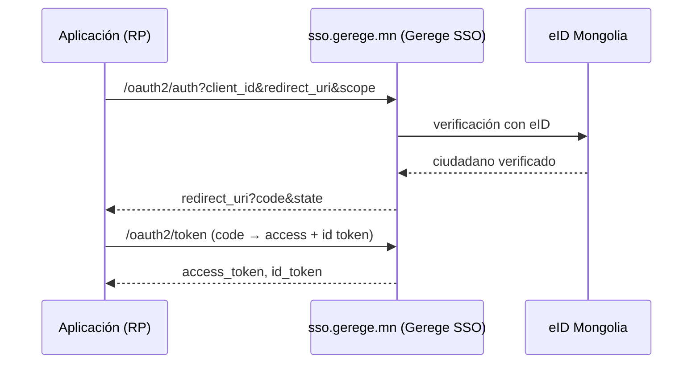

# Autenticación (eID + Gerege SSO)

La plataforma admite:

- **acceso con eID** — con la identidad electrónica (QR / App2App / notificación
  por número de registro);
- **vinculación con Google** — vincular una cuenta de Google tras una
  verificación con eID;
- **Gerege SSO (OIDC)** — la propia plataforma actúa como proveedor OpenID
  Connect y las aplicaciones acceden a través de ella.

## Dos papeles — `AUTH_MODE`

Dónde inicia sesión la persona usuaria en esta plataforma no es una diferencia
de código, sino **configuración**:

| `AUTH_MODE` | En la portada y en `/login` | Uso habitual |
|---|---|---|
| `provider` | La tarjeta de acceso (eID n.º de registro/QR · Google) se muestra aquí | Un servicio de identidad (`sso.dgov.mn`, `sso.gerege.mn`) |
| `client` | Redirección al SSO superior (`SSO_ISSUER`) | Una plataforma que lo consume (el despliegue de referencia de esta plantilla) |

Si no se define, se deduce de si `SSO_CLIENT_ID` está configurado.

Así, **un servicio SSO y una plataforma que lo consume ejecutan el mismo
código**: la misma imagen de Docker arranca en cualquiera de los dos papeles
según su entorno.

!!! note "Ser issuer es una cuestión APARTE"
    `AUTH_MODE` responde a «dónde inician sesión **los usuarios de esta
    plataforma**». Si esta plataforma es issuer **para otras aplicaciones** lo
    decide por separado `OAUTH_ISSUER`, más abajo; ambos pueden estar activos a
    la vez.

El frontend obtiene su modo del endpoint público `GET /api/v1/site/auth`:

```json
{ "mode": "client", "sso_issuer": "https://sso.gerege.mn", "provider": false }
```

Más: [Configuración](configuration.md).

## Acceso con eID

Notificación directa a la aplicación eID (App2App) o lectura de un código QR.
Las sesiones usan JWT de acceso + de actualización (con rotación); el cierre de
sesión revoca ambos (lista de denegación de acceso y actualización). No hay
contraseña ni acceso por correo/OTP.

El `sub` (sujeto) es el **identificador estable y opaco por ciudadano** de la
plataforma (UUID de usuario), que se pasa al proveedor OIDC integrado durante el
flujo.

## Gerege SSO (proveedor OIDC)

La plataforma es un proveedor OpenID Connect construido sobre su **propio código
Go**. Las aplicaciones parte confiante (RP) le delegan el acceso y reciben los
datos verificados del usuario como claims estándar.



!!! tip "El SSO es un servicio integrado (básico)"
    El acceso SSO se sirve automáticamente a **toda aplicación registrada**
    mediante los ámbitos OIDC básicos (`openid profile email`). No se concede ni
    se bloquea aplicación por aplicación. En cambio, los servicios
    **complementarios** (como el proxy eID) sí requieren autorización por
    aplicación: véase [Proxy de servicios eID](eid-services.md).

Para conectar tu aplicación como RP, véase
[Integración de una aplicación](sso-integration.md).
