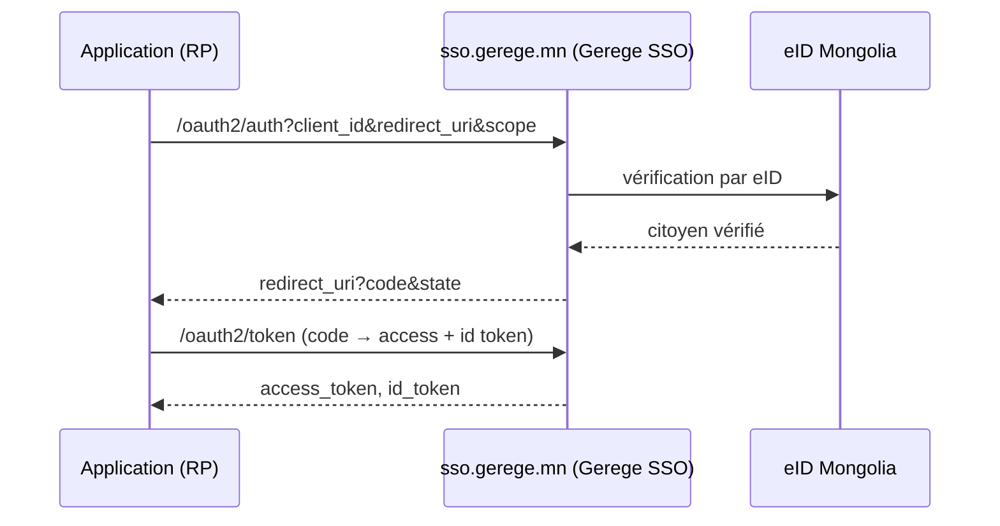

# Authentification (eID + Gerege SSO)

La plateforme prend en charge :

- **la connexion eID** — avec l'identité électronique (QR / App2App / notification
  par numéro de registre) ;
- **la liaison Google** — lier un compte Google après une vérification eID ;
- **Gerege SSO (OIDC)** — la plateforme agit elle-même comme fournisseur OpenID
  Connect ; les applications s'y connectent.

## Deux rôles — `AUTH_MODE`

L'endroit où l'utilisateur final se connecte sur cette plateforme n'est pas une
différence de code mais une **configuration** :

| `AUTH_MODE` | Sur la page d'accueil et `/login` | Usage typique |
|---|---|---|
| `provider` | La carte de connexion (eID n° de registre/QR · Google) s'affiche ici | Un service d'identité (`sso.dgov.mn`, `sso.gerege.mn`) |
| `client` | Redirection vers le SSO amont (`SSO_ISSUER`) | Une plateforme qui le consomme (déploiement de référence de ce modèle) |

S'il n'est pas défini, le mode est déduit de la présence de `SSO_CLIENT_ID`.

Ainsi **un service SSO et une plateforme qui l'utilise exécutent le même code** —
la même image Docker démarre dans l'un ou l'autre rôle selon son environnement.

!!! note "Être issuer est une question DISTINCTE"
    `AUTH_MODE` répond à « où se connectent **les utilisateurs de cette
    plateforme** ». Le fait que cette plateforme soit issuer **pour d'autres
    applications** est décidé séparément par `OAUTH_ISSUER` ci-dessous — les deux
    peuvent être actifs simultanément.

Le frontend lit son mode depuis le point d'accès public `GET /api/v1/site/auth` :

```json
{ "mode": "client", "sso_issuer": "https://sso.gerege.mn", "provider": false }
```

Plus : [Configuration](configuration.md).

## Connexion eID

Notification directe vers l'application eID (App2App) ou lecture d'un QR code.
Les sessions reposent sur des jetons JWT d'accès + de rafraîchissement
(rotation) ; la déconnexion révoque les deux (liste de refus pour l'accès et le
rafraîchissement). Il n'y a ni mot de passe ni connexion par e-mail/OTP.

Le `sub` (sujet) est l'**identifiant stable et opaque par citoyen** de la
plateforme (UUID utilisateur), transmis au fournisseur OIDC intégré dans le flux.

## Gerege SSO (fournisseur OIDC)

La plateforme est un fournisseur OpenID Connect bâti sur son **propre code Go**.
Les applications parties utilisatrices (RP) lui délèguent la connexion et
reçoivent les données vérifiées de l'utilisateur sous forme de claims standard.



!!! tip "Le SSO est un service intégré (de base)"
    La connexion SSO est fournie automatiquement à **toute application
    enregistrée** via les portées OIDC de base (`openid profile email`). Elle
    n'est ni accordée ni bloquée application par application. Les services
    **complémentaires** (comme le proxy eID) exigent en revanche une autorisation
    par application — voir [Proxy des services eID](eid-services.md).

Pour connecter votre application comme RP, voir
[Intégration d'une application](sso-integration.md).
