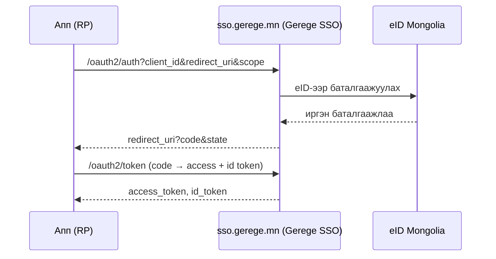

# Нэвтрэлт (eID + Gerege SSO)

Платформ дараах нэвтрэлтийг дэмжинэ:

- **eID нэвтрэлт** — цахим үнэмлэхээр (QR / App2App / РД push).
- **Google холболт** — eID баталгаажуулалтын дараа Google дансаа холбоно.
- **Gerege SSO (OIDC)** — платформ өөрөө OpenID Connect провайдер болж, апп-ууд
  түүгээр дамжин нэвтэрнэ.

## Хоёр үүрэг — `AUTH_MODE`

Энэ платформ дээр эцсийн хэрэглэгч **хаана** нэвтрэх нь кодын ялгаа биш,
**тохиргоо**:

| `AUTH_MODE` | Нүүр хуудас ба `/login` дээр | Ердийн хэрэглээ |
|---|---|---|
| `provider` | Нэвтрэх карт (eID РД/QR · Google) энд гарна | Танилтын үйлчилгээ (`sso.dgov.mn`, `sso.gerege.mn`) |
| `client` | Дээд SSO (`SSO_ISSUER`) руу шилжүүлнэ | Түүнийг хэрэглэгч платформ (энэ template-ийн жишиг deploy) |

Тохируулаагүй бол `SSO_CLIENT_ID` бүртгэгдсэн эсэхээс автоматаар гарна.

Иймд **SSO үйлчилгээ ба түүний хэрэглэгч платформ хоёр нэг кодтой** — ижил
Docker image орчны хувьсагчаас хамааран аль ч үүргээр боот хийнэ.

!!! note "Issuer эсэх нь ТУСДАА асуулт"
    `AUTH_MODE` нь «энэ платформын **хэрэглэгч** хаана нэвтрэх вэ» гэдгийг
    заана. «Энэ платформ **бусад аппыг** нэвтрүүлэх issuer мөн үү» гэдгийг
    доорх `OAUTH_ISSUER` тусад нь шийднэ — хоёулаа зэрэг идэвхтэй байж болно.

Frontend нь горимоо нийтийн `GET /api/v1/site/auth`-аас уншина:

```json
{ "mode": "client", "sso_issuer": "https://sso.gerege.mn", "provider": false }
```

Дэлгэрэнгүй: [Тохиргоо](configuration.md#нэвтрэх-гадаргуу-auth_mode).

## eID нэвтрэлт

Цахим үнэмлэхийн апп руу шууд мэдэгдэл (App2App) илгээх, эсвэл QR код уншуулна.
Session нь JWT access + refresh (rotation); logout хоёуланг хүчингүй болгоно
(refresh + access deny-list). Нууц үг / и-мэйл-OTP нэвтрэлт байхгүй.

`sub` (subject) нь платформын **тогтвортой, opaque per-citizen танигч** (user UUID)
бөгөөд OIDC провайдер урсгалд өөрийн провайдер цөмд дамждаг.

## Gerege SSO (OIDC провайдер)

Платформ нь **өөрийн Go код** дээр суурилсан OpenID Connect провайдер. Relying party
(RP) апп-ууд нэвтрэлтээ платформд даатган, хэрэглэгчийн баталгаажсан мэдээллийг
стандарт claim-аар авна.



!!! tip "SSO бол суурь (built-in) үйлчилгээ"
    SSO нэвтрэлт нь **бүх бүртгэгдсэн апп**-д base OIDC scope (`openid profile
    email`)-оор автоматаар үйлчилнэ. Нэвтрэлтийг per-app checkbox-оор олгодоггүй,
    хаадаггүй. Харин **нэмэлт** service-үүд (eID proxy гэх мэт) нь per-app
    зөвшөөрөл шаарддаг — [eID Service Proxy](eid-services.md)-г үз.

Апп-аа RP болгож холбохыг [Апп холбох](sso-integration.md)-оос үзнэ үү.
