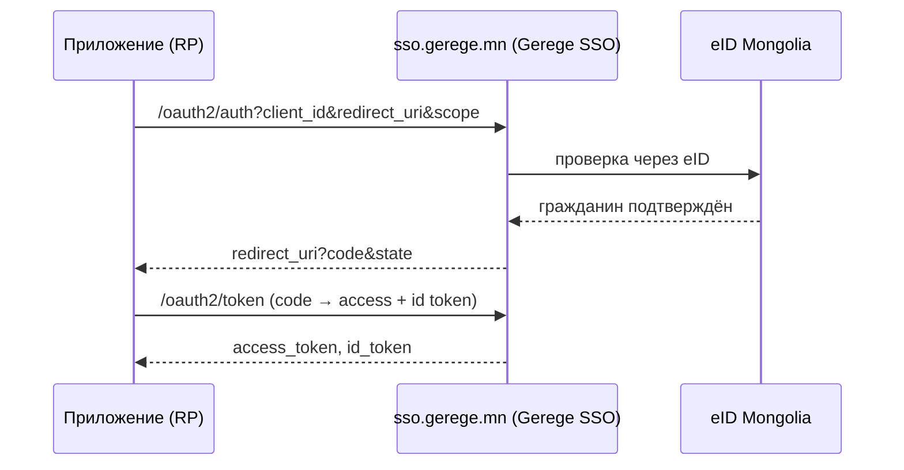

# Аутентификация (eID + Gerege SSO)

Платформа поддерживает:

- **Вход через eID** — по электронному удостоверению (QR / App2App / push по регистрационному номеру).
- **Привязку Google** — привязать аккаунт Google после подтверждения через eID.
- **Gerege SSO (OIDC)** — платформа сама выступает провайдером OpenID Connect;
  приложения входят через неё.

## Две роли — `AUTH_MODE`

То, где конечный пользователь входит на эту платформу, — не различие в коде, а
**конфигурация**:

| `AUTH_MODE` | На главной странице и `/login` | Типичное применение |
|---|---|---|
| `provider` | Карточка входа (eID рег. номер/QR · Google) отображается здесь | Служба идентификации (`sso.dgov.mn`, `sso.gerege.mn`) |
| `client` | Перенаправление в вышестоящий SSO (`SSO_ISSUER`) | Платформа-потребитель (эталонное развёртывание этого шаблона) |

Если параметр не задан, режим выводится из наличия `SSO_CLIENT_ID`.

Таким образом **служба SSO и пользующаяся ею платформа работают на одном коде** —
один и тот же образ Docker загружается в любой роли в зависимости от окружения.

!!! note "Быть issuer — ОТДЕЛЬНЫЙ вопрос"
    `AUTH_MODE` отвечает на вопрос «где входят **пользователи этой платформы**».
    Является ли платформа issuer-ом **для других приложений**, определяется
    отдельно параметром `OAUTH_ISSUER` ниже — оба режима могут быть активны
    одновременно.

Фронтенд получает режим из публичного `GET /api/v1/site/auth`:

```json
{ "mode": "client", "sso_issuer": "https://sso.gerege.mn", "provider": false }
```

Подробнее: [Конфигурация](configuration.md).

## Вход через eID

Push прямо в приложение eID (App2App) или сканирование QR-кода. Сессии — JWT
access + refresh (с ротацией); выход отзывает оба (refresh + список запрещённых
access-токенов). Входа по паролю или email/OTP нет.

`sub` (subject) — это **стабильный непрозрачный идентификатор гражданина**
платформы (UUID пользователя), который передаётся встроенному провайдеру OIDC в потоке.

## Gerege SSO (провайдер OIDC)

Платформа — провайдер OpenID Connect, построенный на **собственном Go-коде**.
Приложения — доверяющие стороны (RP) — делегируют ей вход и получают
подтверждённые данные пользователя в виде стандартных claims.



!!! tip "SSO — базовый (встроенный) сервис"
    Вход через SSO автоматически доступен **каждому зарегистрированному приложению**
    через базовые OIDC-scope (`openid profile email`). Вход не выдаётся и не
    блокируется отдельно по приложениям. А вот **дополнительные** сервисы
    (например, прокси eID) требуют выдачи доступа каждому приложению —
    см. [Прокси сервисов eID](eid-services.md).

Чтобы подключить своё приложение как RP, см. [Подключение приложения](sso-integration.md).
