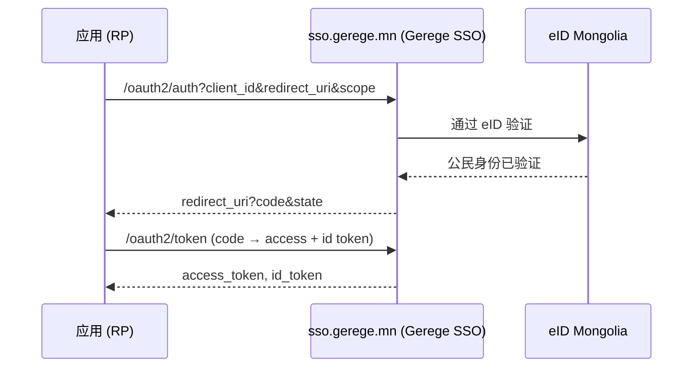

# 身份认证（eID + Gerege SSO）

平台支持：

- **eID 登录** — 使用电子身份证（二维码 / App2App / 按登记号推送）。
- **Google 绑定** — 在完成 eID 验证后绑定 Google 账户。
- **Gerege SSO（OIDC）** — 平台自身即为 OpenID Connect 提供方；各应用通过它登录。

## 两种角色 —— `AUTH_MODE`

终端用户在本平台上**在哪里登录**，不是代码差异，而是**配置**：

| `AUTH_MODE` | 在首页与 `/login` 上 | 典型用途 |
|---|---|---|
| `provider` | 登录卡片（eID 登记号／二维码 · Google）显示在这里 | 身份服务（`sso.dgov.mn`、`sso.gerege.mn`） |
| `client` | 跳转到上游 SSO（`SSO_ISSUER`） | 使用它的平台（本模板的参考部署） |

未设置时，会根据是否配置了 `SSO_CLIENT_ID` 自动推导。

因此 **SSO 服务与使用它的平台运行同一份代码** —— 同一个 Docker 镜像会依据环境
变量启动为其中任一角色。

!!! note "是否作为 issuer 是另一个问题"
    `AUTH_MODE` 回答的是「**本平台的用户**在哪里登录」。本平台是否为**其他应用**
    签发令牌，由下文的 `OAUTH_ISSUER` 单独决定 —— 两者可以同时启用。

前端从公开接口 `GET /api/v1/site/auth` 读取自身模式：

```json
{ "mode": "client", "sso_issuer": "https://sso.gerege.mn", "provider": false }
```

详见：[配置](configuration.md)。

## eID 登录

可直接向 eID 应用推送（App2App），也可扫描二维码。会话采用 JWT access + refresh
（带轮换）；登出会同时吊销二者（refresh + access 拒绝名单）。平台不提供密码或
邮箱/OTP 登录方式。

`sub`（subject）是平台为每位公民分配的**稳定且不透明的标识符**（用户 UUID），
在流程中传递给内置的 OIDC 提供方。

## Gerege SSO（OIDC 提供方）

平台是一个基于**自研 Go 代码**构建的 OpenID Connect 提供方。依赖方（RP）应用
将登录委托给平台，并以标准 claims 的形式获取已验证的用户信息。



!!! tip "SSO 属于内置（基础）服务"
    SSO 登录会通过基础 OIDC scope（`openid profile email`）自动提供给**每一个已注册应用**。
    登录权限不按应用逐个授予或阻止。而**附加**服务（例如 eID 代理）则确实需要按应用授权 —
    参见 [eID 服务代理](eid-services.md)。

要将您的应用接入为 RP，请参阅[应用接入](sso-integration.md)。
